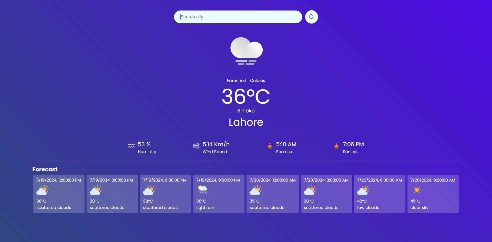

# Weather App

A weather application built with React that provides current weather information and a 3-day forecast using data from the OpenWeather API.

## Features

- Fetches and displays the current weather for a specified city.
- Provides a 3-day weather forecast.
- Displays weather icons based on the weather condition.
- Shows additional weather details such as humidity, wind speed, and sunrise time.
- Automatically fetches weather data for a default city on initial load.

## Screenshots



## Installation

1. Clone the repository:
    ```bash
    git clone https://github.com/zeemaarCA/react-weather-app.git
    cd react-weather-app
    ```

2. Install dependencies:
    ```bash
    npm install
    ```

3. Create a `.env` file in the root directory and add your OpenWeather API key:
    ```
    VITE_APP_ID=your_openweather_api_key
    ```

4. Start the development server:
    ```bash
    npm run dev
    ```

## Usage

1. Open the app in your browser. By default, it fetches the weather data for Lahore.
2. To search for the weather in a different city, enter the city name in the search bar and click the search icon.

## Code Explanation

- `Weather.js`: Contains the main component logic for fetching and displaying weather data.
- Uses `fetch` to retrieve data from the OpenWeather API.
- Uses `Promise.all` to fetch current weather and forecast data concurrently.
- Converts UNIX timestamps to readable time formats with AM/PM.

## Example Code Snippet

Here's a snippet of the main fetching logic in `Weather.js`:

```javascript
const search = async (city) => {
  if (city === "") {
    alert("Enter city name");
    return;
  }
  try {
    const currentWeatherUrl = `https://api.openweathermap.org/data/2.5/weather?q=${city}&units=metric&appid=${import.meta.env.VITE_APP_ID}`;
    const forecastUrl = `https://api.openweathermap.org/data/2.5/forecast/?q=${city}&units=metric&cnt=10&appid=${import.meta.env.VITE_APP_ID}`;

    const [currentWeatherResponse, forecastResponse] = await Promise.all([
      fetch(currentWeatherUrl),
      fetch(forecastUrl),
    ]);

    const currentWeatherData = await currentWeatherResponse.json();
    const forecastData = await forecastResponse.json();

    const currentIcon = allIcons[currentWeatherData.weather[0].icon] || clear_icon;
    setWeatherData({
      humidity: currentWeatherData.main.humidity,
      windSpeed: currentWeatherData.wind.speed,
      temperature: Math.floor(currentWeatherData.main.temp),
      location: currentWeatherData.name,
      icon: currentIcon,
      sunrise: new Date(currentWeatherData.sys.sunrise * 1000).toLocaleTimeString("en-US", {
        hour: "2-digit",
        minute: "2-digit",
        hour12: true
      }),
    });

    setForecastData(forecastData.list.slice(0, 3));
  } catch (error) {
    console.error(error);
    return false;
  }
};
